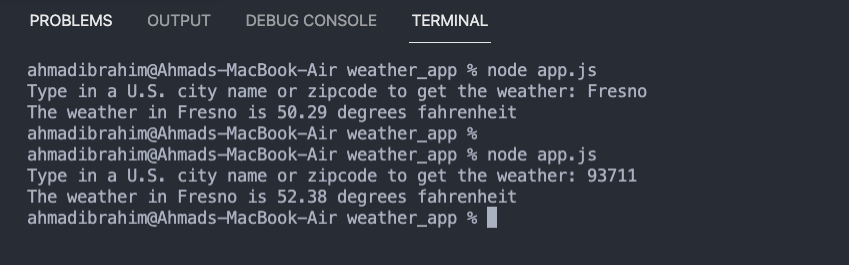

# weather_app

The weather app pulls weather data from the open weather api based on the arguments passed in to the application through the command line.

## Example

## app.js

The app.js file uses the readline module to prompt user to input a U.S. city or zipcode and then passes the user input to the weather app module.

## weather.js

The weather.app module takes the user input and request weather data from the openweather api, printing the current temperature to the console.

## Table of Contents

- [weather_app](#weather_app)
  - [Example](#example)
  - [app.js](#appjs)
  - [weather.js](#weatherjs)
  - [Table of Contents](#table-of-contents)
